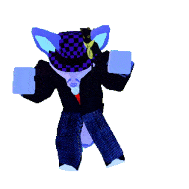

# Welcome to Bread's Bio

Me when I game

You can use the [editor on GitHub](https://github.com/BurntBread007/burntbread007.github.io/edit/main/README.md) to maintain and preview the content for your website in Markdown files.

Whenever you commit to this repository, GitHub Pages will run [Jekyll](https://jekyllrb.com/) to rebuild the pages in your site, from the content in your Markdown files.

## **Coding**
- 1 year **Python intro class**
- 2 years **AP CS**; _1 year JS, 1 year Java_
- Self-taught basic **scripting in Unity** _(C#)_
### **Achievements**
- FunkyXML
- Java IM

## **3D Modeling**
- 1 year **3D 'animation'**; _Premiere Pro + After Effects + little bit of Maya_
- **Self-taught Blender** on-and-off since 2019
### **Achievements**
- Kobold in grass

- Pixar Lamp

- Arcade

- Kirby

## **Gaming**
- **VR gamer** since 2020; WMR 2020-2021, Rift CV1 2021-Present
- **Competitve Beat Saber** July 2020-Present; Best Rank #2500, Top 1.00%
- (quite amateur) **Retro Game Collector**; GameCube, OG XB/360, N64
- (currently) Trying out **SM64 mods** using the decomp
### **Achievements**
- BSaber Videos
- Screenshots of leaderboard

GitHub Flavored Markdown](https://guides.github.com/features/mastering-markdown/).

## CONTACT INFO
Discord: TBD
[YouTube]() Burnt Bread, Br3D
[Instagram]() @breads.blender
[GitHub](https://github.com/burntbread007) BurntBread007
[Steam](https://steamcommunity.com/id/burntbread007/) BurntBread007